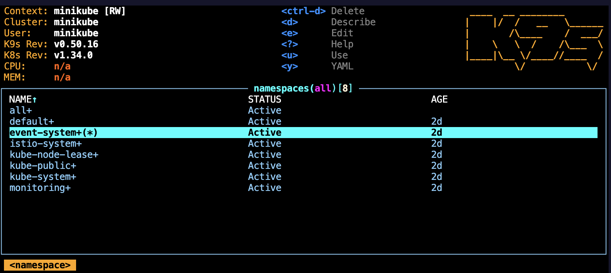
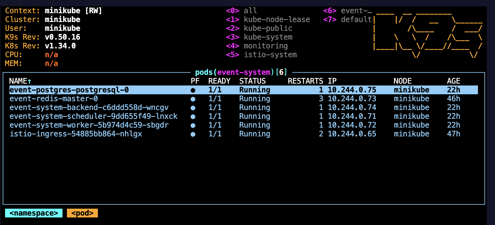
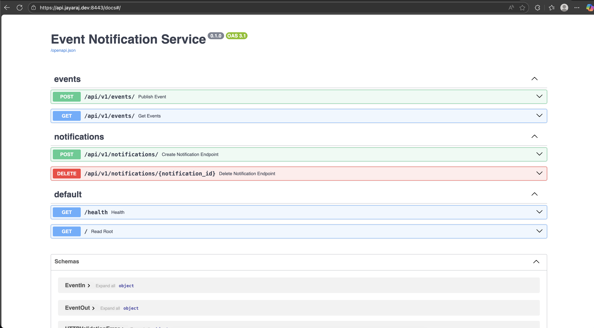
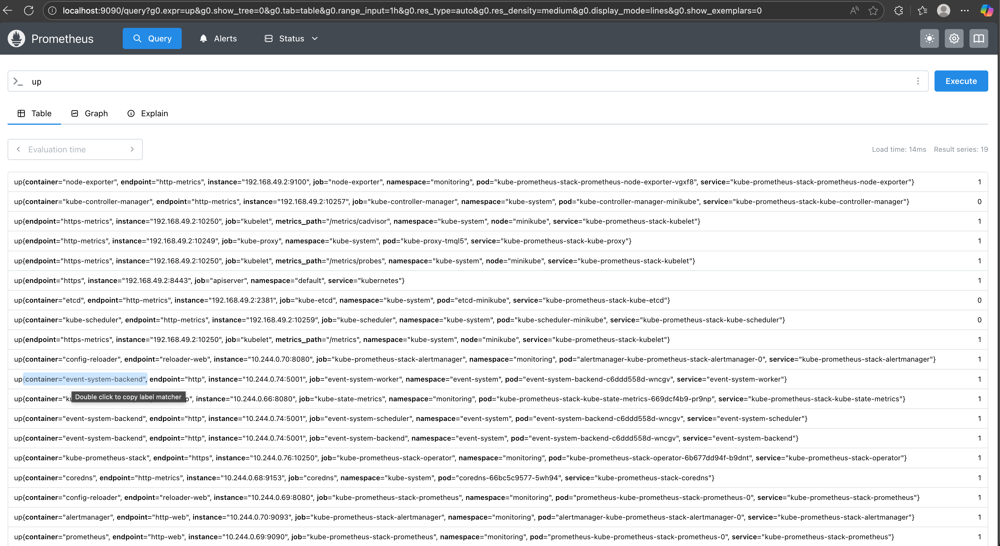
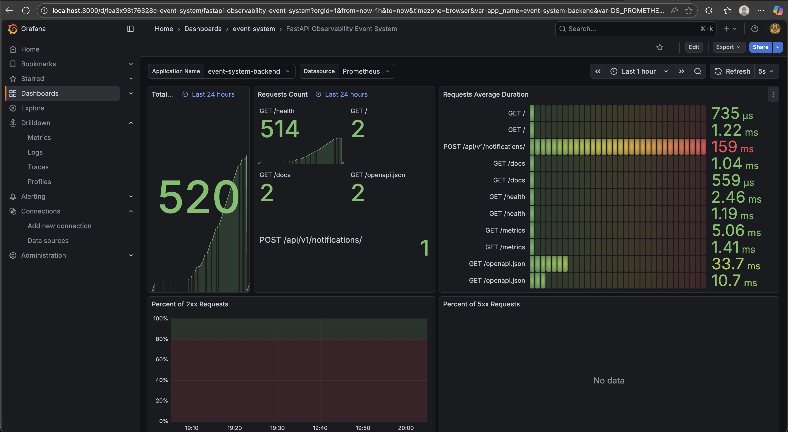

# 📣 Event Notification Service API

A backend, machine-to-machine (M2M) service for ingesting events and scheduling reliable, time‑based notifications. Intended for integration with backend services, schedulers, and event-driven pipelines — not direct human use.

---

## Table of Contents
- Overview
- Key use cases
- API (quick reference)
- Design principles
- Kubernetes Quickstart
- Observability
- Troubleshooting
- Contributing & License

---

## Overview
The Event Notification Service persists events and schedules notifications asynchronously. It decouples event production from delivery and is optimized for reliability and scale.

Who should use this:
- Backend services
- Event producers and workflows
- Job schedulers and automation systems

---

## Key Use Cases
- Event-driven notifications (signup, payment, subscription changes)
- Scheduled reminders (N days before a target date)
- Automation pipelines: publish event → schedule notification → background workers deliver

---

## API (quick reference)
- POST /api/v1/events/ — Publish an event
- GET  /api/v1/events/ — List events
- POST /api/v1/notifications/ — Create a scheduled notification
- DELETE /api/v1/notifications/{id} — Cancel a notification
- GET  /health — Liveness & dependency status

Notes:
- Events are signals (not delivery).
- Notifications are persisted immediately; scheduling runs asynchronously.
- Scheduling failures are logged and do not block API responses.

---

## Design Principles
- Persistence first, scheduling later
- Pluggable delivery providers (email, SMS, webhooks)
- Delivery decoupled from API request paths
- Observability for retries, dead-letter handling, and delivery status

---

## Kubernetes Quickstart (Helm)

Prerequisites:
- kubectl, helm, mkcert, and a local K8s (minikube / colima / Docker Desktop)
- Add host entry for local TLS testing (example):
  - 127.0.0.1 api.jayaraj.dev

Increase local cluster resources if you hit TLS/handshake issues:
- minikube: minikube start --cpus=4 --memory=8192
- colima: colima start --cpu 6 --memory 12

Add Helm repos:
```bash
helm repo add prometheus-community https://prometheus-community.github.io/helm-charts
helm repo add bitnami https://charts.bitnami.com/bitnami
helm repo add istio https://istio-release.storage.googleapis.com/charts
helm repo update
```

Create namespaces:
```bash
kubectl create ns event-system
kubectl create ns istio-system
kubectl create ns monitoring
```

TLS (mkcert local dev):
```bash
brew install mkcert
mkcert -install
# produce cert.crt and cert.key for api.jayaraj.dev, then:
kubectl create secret tls api-tls-secret -n event-system --cert=cert.crt --key=cert.key
```

Install Istio (example):
```bash
helm install istio-base istio/base -n istio-system --create-namespace
helm install istiod istio/istiod -n istio-system --wait
helm install istio-ingress istio/gateway -n event-system

Proj-2.0-Docker-K8s-Helm % helm ls -n istio-system
NAME            NAMESPACE       REVISION        UPDATED                                 STATUS          CHART           APP VERSION
istio-base      istio-system    1               2025-12-21 19:42:36.554245 +0530 IST    deployed        base-1.28.1     1.28.1   
istiod          istio-system    1               2025-12-21 19:43:11.914933 +0530 IST    deployed        istiod-1.28.1   1.28.1   
Proj-2.0-Docker-K8s-Helm % 
```

Postgres & Redis (example using Bitnami charts)
- Create a Kubernetes secret for DB credentials (do NOT store plaintext in repo):
```bash
kubectl create secret generic pg-secret -n event-system \
  --from-literal=username=<DB_USER> \
  --from-literal=password=<DB_USER_PASSWORD> \
  --from-literal=postgres-password=<DB_ADMIN_PASSWORD> \
  --from-literal=database=notifications
```
- Install charts (values abbreviated):
```bash
helm install event-postgres bitnami/postgresql -n event-system \
  --set auth.existingSecret=pg-secret \
  --set auth.username=user \
  --set auth.secretKeys.adminPasswordKey=postgres-password \
  --set auth.secretKeys.userPasswordKey=password \
  --set auth.database=notifications \
  --set volumePermissions.enabled=true \
  --set persistence.size=1Gi

helm install event-redis bitnami/redis -n event-system \
  --set architecture=standalone --set auth.enabled=false --set usePassword=false  --set master.persistence.size=500Mi
```

To get the DB password later:
```bash
kubectl get secret --namespace event-system pg-secret -o jsonpath="{.data.password}" | base64 -d; echo
```


Install the service:
```bash
helm upgrade --install event-system ./event-system -n event-system
```

Test DB connection (run a psql client pod and connect to the service host):
```bash
kubectl run psql-test --rm -it --namespace event-system --image bitnami/postgresql:latest -- bash
# then inside the pod run psql -h event-postgres-postgresql -U <DB_USER> -d notifications
```

Set up Monitoring (Prometheus + Grafana):
```bash
helm install kube-prometheus-stack prometheus-community/kube-prometheus-stack -n monitoring

for grafana, default user is admin; get the password with:

kubectl --namespace monitoring get secrets kube-prometheus-stack-grafana -o jsonpath="{.data.admin-password}" | base64 -d ; echo
```

Check deployed pods & services under monitoring namespace:
```bash
kubectl get all -n monitoring
NAME                                                       READY   STATUS            RESTARTS   AGE
alertmanager-kube-prometheus-stack-alertmanager-0          2/2     Running           0          50s
kube-prometheus-stack-grafana-59b75df58c-k9mmp             3/3     Running           0          2m58s
kube-prometheus-stack-kube-state-metrics-669dcf4b9-pr9np   1/1     Running           0          2m58s
kube-prometheus-stack-operator-6b677dd94f-b9dnt            1/1     Running           0          2m58s
kube-prometheus-stack-prometheus-node-exporter-vgxf8       1/1     Running           0          2m58s
prometheus-kube-prometheus-stack-prometheus-0              0/2     PodInitializing   0          50s
Proj-2.0-Docker-K8s-Helm % kubectl get pods -n monitoring
NAME                                                       READY   STATUS    RESTARTS   AGE
alertmanager-kube-prometheus-stack-alertmanager-0          2/2     Running   0          105s
kube-prometheus-stack-grafana-59b75df58c-k9mmp             3/3     Running   0          3m53s
kube-prometheus-stack-kube-state-metrics-669dcf4b9-pr9np   1/1     Running   0          3m53s
kube-prometheus-stack-operator-6b677dd94f-b9dnt            1/1     Running   0          3m53s
kube-prometheus-stack-prometheus-node-exporter-vgxf8       1/1     Running   0          3m53s
prometheus-kube-prometheus-stack-prometheus-0              2/2     Running   0          105s
Proj-2.0-Docker-K8s-Helm % clear
Proj-2.0-Docker-K8s-Helm % kubectl get all -n monitoring
NAME                                                           READY   STATUS    RESTARTS   AGE
pod/alertmanager-kube-prometheus-stack-alertmanager-0          2/2     Running   0          2m42s
pod/kube-prometheus-stack-grafana-59b75df58c-k9mmp             3/3     Running   0          4m50s
pod/kube-prometheus-stack-kube-state-metrics-669dcf4b9-pr9np   1/1     Running   0          4m50s
pod/kube-prometheus-stack-operator-6b677dd94f-b9dnt            1/1     Running   0          4m50s
pod/kube-prometheus-stack-prometheus-node-exporter-vgxf8       1/1     Running   0          4m50s
pod/prometheus-kube-prometheus-stack-prometheus-0              2/2     Running   0          2m42s

NAME                                                     TYPE        CLUSTER-IP       EXTERNAL-IP   PORT(S)                      AGE
service/alertmanager-operated                            ClusterIP   None             <none>        9093/TCP,9094/TCP,9094/UDP   2m42s
service/kube-prometheus-stack-alertmanager               ClusterIP   10.105.116.124   <none>        9093/TCP,8080/TCP            4m50s
service/kube-prometheus-stack-grafana                    ClusterIP   10.104.124.186   <none>        80/TCP                       4m50s
service/kube-prometheus-stack-kube-state-metrics         ClusterIP   10.96.185.158    <none>        8080/TCP                     4m50s
service/kube-prometheus-stack-operator                   ClusterIP   10.106.151.191   <none>        443/TCP                      4m50s
service/kube-prometheus-stack-prometheus                 ClusterIP   10.110.72.212    <none>        9090/TCP,8080/TCP            4m50s
service/kube-prometheus-stack-prometheus-node-exporter   ClusterIP   10.107.195.126   <none>        9100/TCP                     4m50s
service/prometheus-operated                              ClusterIP   None             <none>        9090/TCP                     2m42s

NAME                                                            DESIRED   CURRENT   READY   UP-TO-DATE   AVAILABLE   NODE SELECTOR            AGE
daemonset.apps/kube-prometheus-stack-prometheus-node-exporter   1         1         1       1            1           kubernetes.io/os=linux   4m50s

NAME                                                       READY   UP-TO-DATE   AVAILABLE   AGE
deployment.apps/kube-prometheus-stack-grafana              1/1     1            1           4m50s
deployment.apps/kube-prometheus-stack-kube-state-metrics   1/1     1            1           4m50s
deployment.apps/kube-prometheus-stack-operator             1/1     1            1           4m50s

NAME                                                                 DESIRED   CURRENT   READY   AGE
replicaset.apps/kube-prometheus-stack-grafana-59b75df58c             1         1         1       4m50s
replicaset.apps/kube-prometheus-stack-kube-state-metrics-669dcf4b9   1         1         1       4m50s
replicaset.apps/kube-prometheus-stack-operator-6b677dd94f            1         1         1       4m50s

NAME                                                               READY   AGE
statefulset.apps/alertmanager-kube-prometheus-stack-alertmanager   1/1     2m42s
statefulset.apps/prometheus-kube-prometheus-stack-prometheus       1/1     2m42s

```

Ingress & port-forwarding:
```bash
sudo nano /etc/hosts ===> Add `127.0.0.1   api.jayaraj.dev`

kubectl port-forward -n event-system svc/istio-ingress 8443:443
# Add host entry and test:
curl -k https://api.jayaraj.dev:8443/
{"message":"Welcome to the Event Notification Service API","docs":"/docs"}%  

Go to: `https://api.jayaraj.dev:8443/metrics` to see fast-api metrics

# Metrics:
kubectl port-forward -n monitoring svc/kube-prometheus-stack-prometheus 9090:9090
kubectl port-forward -n monitoring svc/kube-prometheus-stack-grafana 3000:80

# Grafana UI: http://localhost:3000
# Prometheus UI: http://localhost:9090

In Prometheus, use `up{job="event-system"}` to see if the service is up.
Create dashboards in Grafana by importing existing dashboard IDs or provisioning your own.

Test the deployed application using the test-deployed-backend.py script
```

(Replace example hostnames, secrets, and values with your environment-specific settings.)


<!-- K9s after deplopyment -->




<!-- Swagger UI for backend -->


---

## Observability
- Prometheus metrics exposed at /metrics
- Grafana dashboards (provision or import existing dashboard IDs)
- Logs and retry/dead-letter queues for failed deliveries

<!-- Prometheus Logs -->


<!-- Grafana Dashboard -->


---

## Troubleshooting
- TLS / handshake failures: increase CPU/memory for your local cluster (see Quickstart)
- DB connection issues: verify secret values and service DNS in the target namespace
- Scheduling failures: check background worker logs and the scheduling queue (Redis)

---

## Files & Artifacts
- Helm chart: ./event-system
- Example scripts: test-deployed-backend.py (use for smoke-tests)
- Dashboards and screenshots (kept under image/README/)

---

